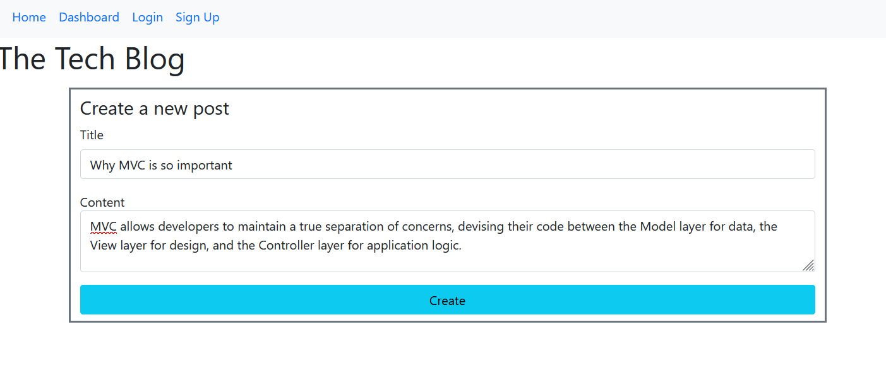
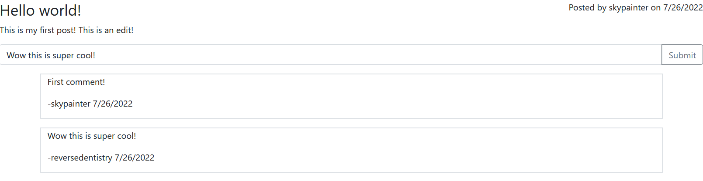

# Tech Blog Using MVC

## Description
The Model-View-Controller paradigm, abbreviated as MVC, is a common architectural structural pattern used to help modularize code by sorting them into three main categories: the models, the controllers, and the views. The models are generally the structure of the information stored in the back end in databases, the views are what users will typically see on the front end, and the controllers are the things that link the two together when sending and retrieving information back and forth. 

This application is built using this paradigm. It is a CMS-style blog that allows users who make accounts to create, edit, and delete posts as well as leave comments on posts. This is a full stack application: it uses MySQL as the database that stores data, Sequelize as the ORM for sending and retrieving information, and the Handlebars template language to build the front end. For user authentication the express-session npm package is used. The bcrypt module is what is used to encrypt user passwords and the dotenv package is used to hide the developer's credentials when Sequelize is used. 

[This is the link for the deployed app on Heroku.](https://reversedentistry-tech-blog.herokuapp.com/)

### Technologies
- Javascript/Node.js
    - Sequelize
    - Dotenv
    - bCrypt
- Express.js
    - express-session
- Handlebars template language
- MySQL 
- Bootstrap

## Installation Instructions
```
npm i
```

## Usage Instructions
Once you're on the front page of the app, make sure to sign up first. Signing up automatically logs you in right after. Once you are logged in, you can create new posts from the dashboard page and view all the posts you've made on there. This is also where you can edit or delete your own posts. To leave a comment, visit the specific page of the post and submit a comment in the text box provided. 

### Screenshots





## License
This project is MIT licensed. 

## Contact 
- [GitHub](https://github.com/reversedentistry)
- Email: sherylhu@proton.me